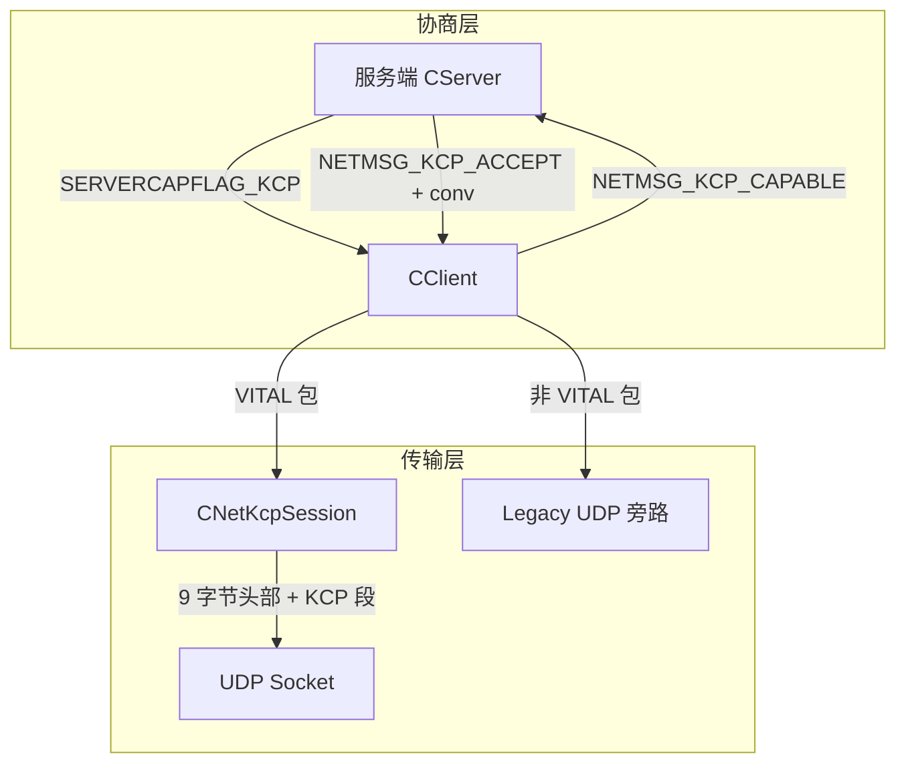
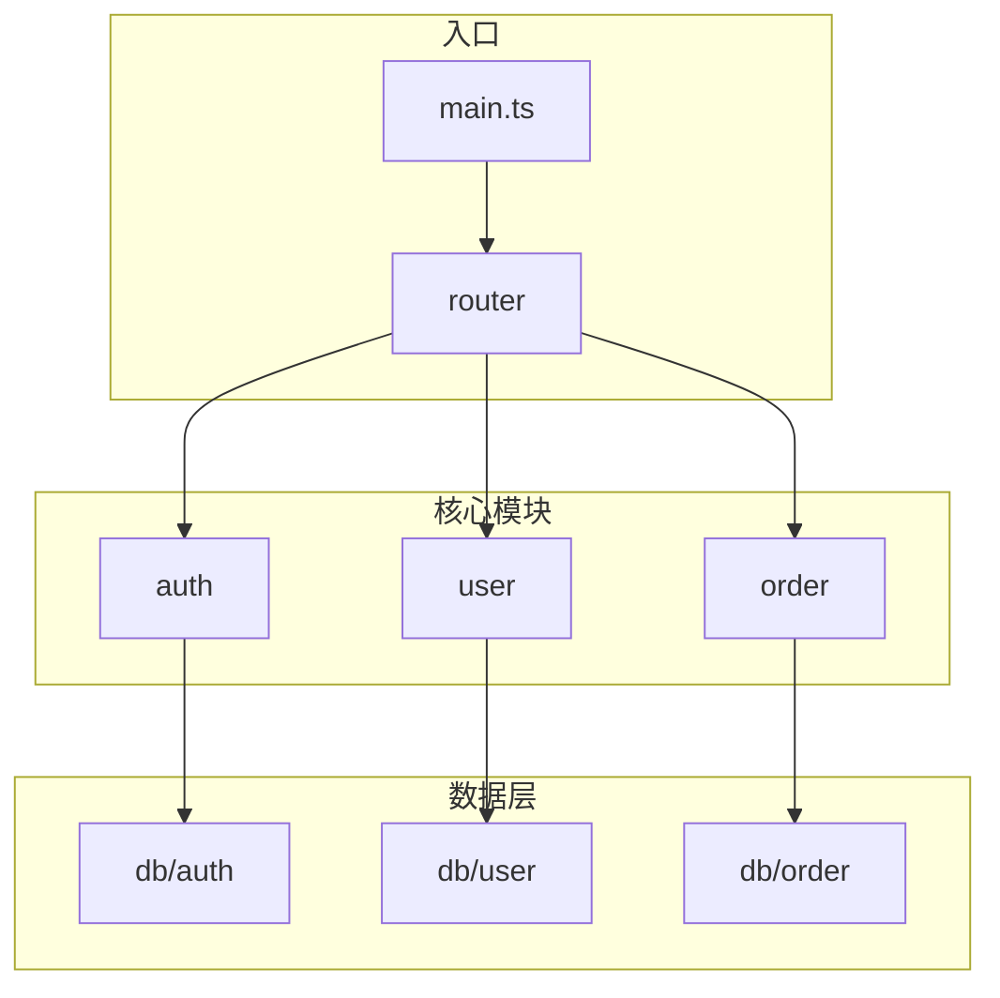
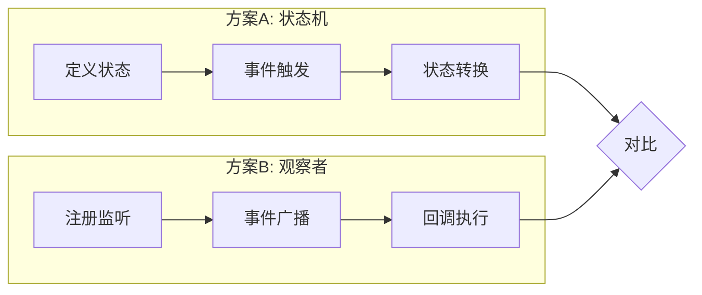

> **📖 中文阅读副本**
> 这是 `code-explore` 文档模板的中文版本，仅供人类日常参考阅读。
> AI 执行时使用同目录下的英文版 `template.md`。

# explore 参考模板

本文件提供 `code-explore` 使用的 frontmatter、正文结构和写作说明。

> **注意：** 以下示例（KCP/DDNet 协议调研）来自外部项目，仅用于演示格式和深度标准。

## 1. frontmatter

```yaml
---
type: question | module-overview | spike
date: YYYY-MM-DD
status: active | outdated
confidence: high | medium | low
scope:
  - path/to/directory
  - path/to/file.ts
commit: <短哈希或标签>
related:
  - file: YYYY-MM-DD-标题.md
    relation: supersedes | complements | contradicts | references
---
```

- `scope`：探索涉及的目录和文件列表——支持 Phase 1.5 的程序化匹配
- `commit`：基于的 VCS 提交短哈希（如 git `abc1234`）或标签。读者可以与当前 HEAD 对比来判断文档是否过时。未提交的改动用 `HEAD`
- `status: outdated` 时需说明原因；若被替代文档取代则补充 `superseded-by: YYYY-MM-DD-{标题}.md`
- 更新已有文档时追加 `updated: YYYY-MM-DD`
- `related`：结构化列表，含 `file` 和 `relation` 字段。`supersedes` = 本文档替代那份；`complements` = 覆盖同一区域的不同方面；`contradicts` = 结论不同；`references` = 一般交叉引用

文件名：`docs/superpowers/explore/YYYY-MM-DD-{中文标题}.md`。

## 2. 正文结构

```markdown
## 速答

<!-- 结论前置——读者打开先看到结论 -->

{2-5 句话的核心结论。module-overview / spike 类型附 Mermaid 图。}

## 关键证据

| # | 结论 | 证据 | 位置 |
|---|------|------|------|
| 1 | {这条证据支撑什么结论} | {代码/配置的实际内容} | `file:line` |

## 细节展开

<!-- 背景、设计意图、边缘情况——不是核心证据但不写又缺上下文 -->

## 探索范围

- 聚焦目录：{路径}
- 涉及文件：{列出关键文件}
- 跳过：{未覆盖的部分和原因}

## 置信度说明

<!-- confidence 为 medium/low 时必须解释原因 -->

## 未决问题

<!-- 还没搞清楚的点——给下次探索提供入口 -->

- {问题描述}

## 相关文档

<!-- 交叉引用到其他 explore / plan / spec -->

- `YYYY-MM-DD-{标题}.md` — {关系说明}

## 后续建议

<!-- 一句话提示用户接下来可能的方向 -->
```

## 3. 各节写法说明

### 速答（最重要）

- **结论前置**——读者打开文档先看到结论，再决定要不要往下看证据
- 2-5 句话概括核心发现
- `module-overview` / `spike` 类型必须附 Mermaid 架构图
- 可操作——告诉读者"入口在哪"、"核心流程是什么"

示例（来自 KCP 服务器协议调研）：
```markdown
## 速答

KCP 是 QmClient 在 DDNet 原生 UDP 之上叠加的**可选可靠传输层**，通过扩展消息协商后激活。核心架构：

```
[游戏协议 CNetConnection/CNetChunk] → [CNetKcpSession/ikcp] → [UDP Socket]
```

协商流程：服务端宣告 `SERVERCAPFLAG_KCP` → 客户端发 `NETMSG_KCP_CAPABLE`
→ 服务端分配 conv ID 并回 `NETMSG_KCP_ACCEPT` → 双方激活 KCP 会话。
**客户端无任何配置项，全自动跟随服务端**。


```

### 关键证据

- 目标 3-8 条，每条必须标注 `file:line`
- 每条证据说明"支撑哪个结论"
- 不支撑任何结论的证据不记录
- 超过 8 条时检查：两条是否支撑同一个点？能合并就合并

示例（来自 KCP 协议调研）：
```markdown
## 关键证据

| # | 结论 | 证据 | 位置 |
|---|------|------|------|
| 1 | KCP 魔术头为 9 字节，格式 QKCP+version+conv(大端) | `s_aKcpMagic[] = {'Q','K','C','P'};` + `s_KcpVersion = 1;` + `NET_KCP_HEADER_SIZE = 9` | `network_kcp.cpp:15-16`, `network.h:121` |
| 2 | MTU = 1400 - 9 = 1391 | `NET_KCP_MTU = NET_MAX_PACKETSIZE - NET_KCP_HEADER_SIZE` | `network.h:122` |
| 3 | 协商标志在 capabilities version 6 引入 | `SERVERCAPFLAG_KCP = 1 << 6,` | `protocol_ex.h:42` |
| 4 | 调优参数硬编码在 ApplyTuning | `ikcp_nodelay(m_pKcp, 1, 10, 2, 0);` + `ikcp_wndsize(m_pKcp, 64, 128);` + `m_pKcp->rx_minrto = 30;` | `network_kcp.cpp:108-119` |
| 5 | 客户端自动触发协商，无需配置 | `if(m_ServerCapabilities.m_Kcp && !m_KcpNegotiated && !m_KcpNegotiationPending)` → `SendKcpCapability(Conn)` | `client.cpp:2008-2010` |
| 6 | 服务端 4 个配置全是 CFGFLAG_SERVER，客户端零配置 | `sv_kcp`/`sv_kcp_required`/`sv_kcp_debug`/`sv_kcp_stats` 全部 `CFGFLAG_SERVER` | `config_variables.h:752-755` |
```

### 细节展开

- 放不适合塞进速答但又不算核心证据的补充说明
- 例如：设计意图、已知边缘情况、与其他模块的间接关系、历史背景
- 这个节可长可短，但不要重复关键证据已有的内容

示例（来自 KCP 协议调研）：
```markdown
## 细节展开

### 混合传输的巧思

不是所有包都需要可靠传输。玩家输入快照（高频、低延迟优先）走 UDP 旁路，
游戏状态同步（必须可靠）走 KCP。这是 QmClient 在可靠性和延迟之间的
精细折中——非关键包绕开 KCP 的重传机制，避免给延迟敏感的包增加尾部延迟。

### KCP 选型原因

KCP 比 TCP 更适合游戏：以 10% 左右的额外带宽开销换取比 TCP 低 30-40% 的
平均 RTT，且不会因单个丢包阻塞整个流（TCP 队头阻塞）。
```

### 探索范围

- 写清楚看了哪些目录/文件
- 写清楚没看什么（让读者知道边界）

示例（来自 KCP 协议调研）：
```markdown
## 探索范围

- 聚焦目录：`src/engine/shared/`、`src/engine/external/kcp/`、`src/engine/client/`、`src/engine/server/`
- 涉及文件：`ikcp.h`、`network_kcp.cpp`、`network.h`、`network_client.cpp`、`network_server.cpp`、`protocol_ex.h`、`protocol_ex_msgs.h`、`config_variables.h`、`client.cpp`、`server.cpp`
- 跳过：KCP 内部拥塞控制细节（`ikcp.c` 实现未被逐行审查）、弱网基准数据收集（`kcp_weaknet_benchmark.py` 仅确认存在未详细分析）
```

### 置信度说明

- confidence 为 medium/low 时必须解释原因
- 说明哪些部分没覆盖、为什么不确定

示例：
```markdown
## 置信度说明

**confidence: high**

- 核心路径全部覆盖：线格式 → 协商 → 数据流 → 调优 → 配置 → 测试
- 所有证据均标注 `file:line`，从真实代码中提取
- 未逐行审查 `ikcp.c` 内部实现（约 1400 行），但不影响对协议集成方式的理解
```
```markdown
## 置信度说明

**confidence: medium**

- 只看了入口和核心函数，未深入错误处理分支
- 旧模块 `legacy/` 目录未覆盖，可能存在尚未迁移的逻辑
- 需要看测试文件确认边界条件处理
```

### 未决问题

- 明确列出"还没搞清楚的点"——比藏在置信度里更诚实
- 给下次探索提供入口，也让读者知道这份报告的知识边界
- 每个问题一句话，不用展开

示例：
```markdown
## 未决问题

- KCP 内部滑动窗口和拥塞控制算法细节未深入（`ikcp.c` ~1400 行）
- `kcp_weaknet_benchmark.py` 的基准测试数据未收集——实际弱网下 KCP vs legacy 的量化对比待补
- 服务端 `sv_kcp_required=1` 在灰度期关闭时的客户端拒绝体验未测试
```

### 后续建议

- 一句话提示用户接下来可能的方向
- 下一步由用户自己决定，不枚举候选技能

示例：
```markdown
## 后续建议

如需要修改 KCP 行为（如调整调优参数、暴露客户端配置项、增加降级策略），
可以基于本文档定位修改点。如需了解 KCP 内部滑动窗口/拥塞控制算法的细节，
需要单独深入 `ikcp.c`。
```

## 4. 搜索已有文档

探索前先检查 `docs/superpowers/explore/` 下是否已有相似文档。按以下维度匹配：

- **文件名关键词**：如 `*KCP*`、`*network*`
- **frontmatter 字段**：`type`、`status`、`confidence`、`scope`（路径）
- **正文标题/内容关键词**：速答节或关键证据表中出现的关键术语

> 示例：在支持 bash/终端 的 agent 中可用 `grep -l "type: module-overview" docs/superpowers/explore/*.md`，或使用你 agent 的等价文件搜索工具（如 Claude Code 的 Glob + Grep、Cursor 的 `@codebase`、omp 的 `search` + `find`、Cline 的 `search_files`、Codex 的 `shell`）。

命中相近旧文档时：
- 先读它，能直接回答就告诉用户"已有一份在 {路径}"，问是否复用还是重探一遍
- 旧文档可能过期：代码已变导致旧结论失效时，在旧文档顶部标注 `> ⚠️ 此文档可能已过期`，新建替代文档
- 旧文档 `status` 已是 `outdated`：直接新建替代，并在新文档中引用旧文档（`superseded-by` 反向链接）

## 5. Mermaid 图示例

### module-overview 类型



### spike 类型（多方向对比）



## 6. 反模式对照

| 反模式 | 正确做法 |
|--------|----------|
| 结论写在证据后面 | 速答节必须在前 |
| 证据无 `file:line` | 每条证据标具体位置 |
| 证据条数过多 | 精简到 3-8 条，删掉不支撑结论的；两条支撑同一点就合并 |
| 无 Mermaid 图（module-overview/spike） | 速答节附架构图 |
| confidence 与证据不匹配 | 证据少就降为 medium/low |
| 引用旧探索但不确认 `status` | 读旧文档时先看 frontmatter 的 `status` 字段，`outdated` 文档仅作参考并标注 |
