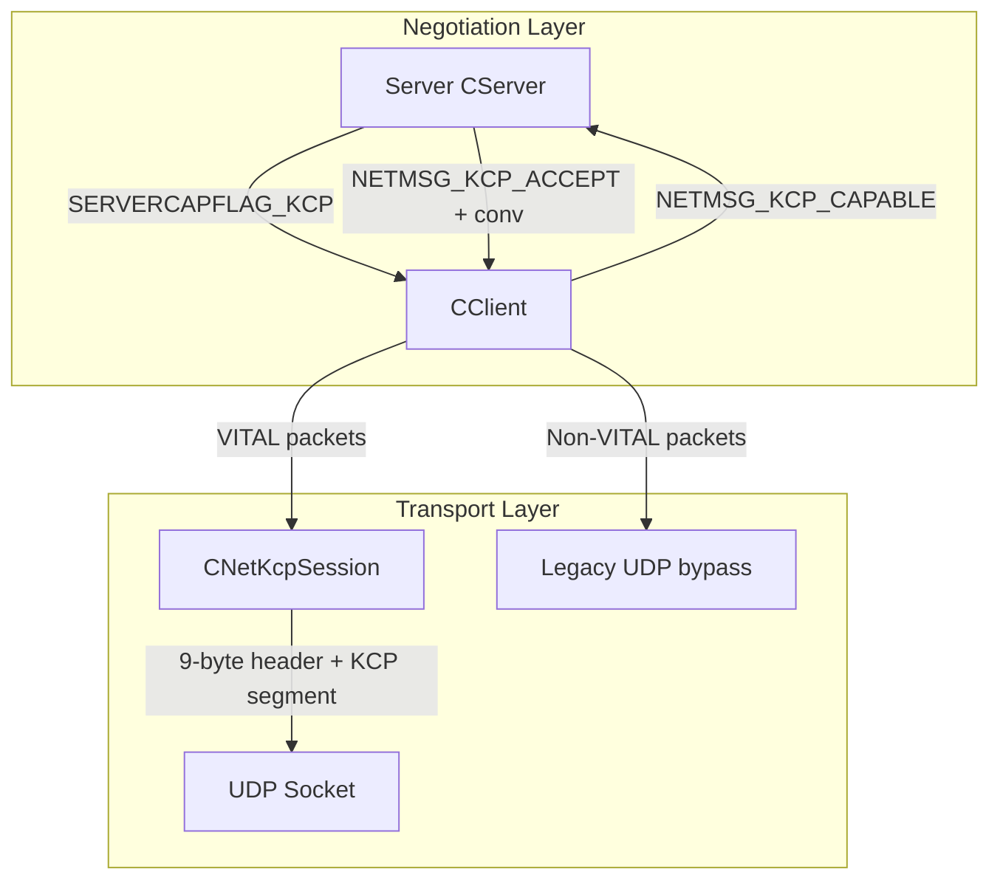
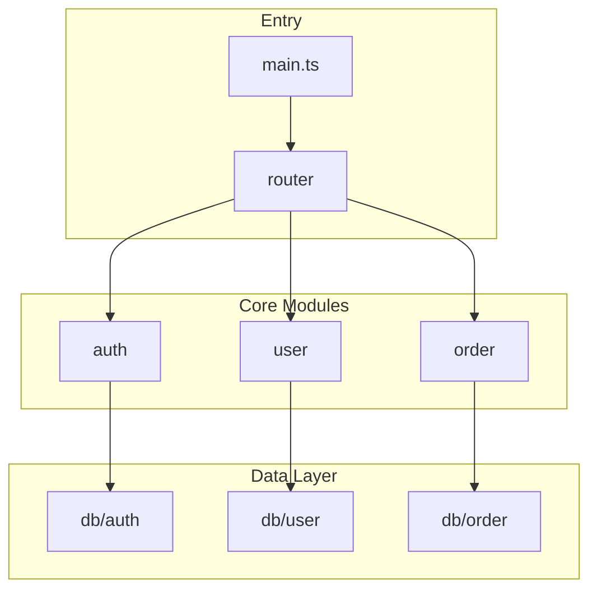
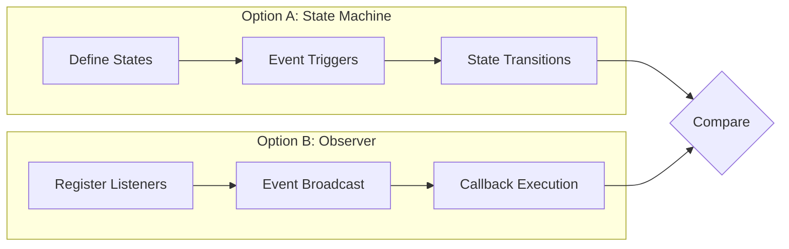

# Explore Reference Template

This file provides the frontmatter, body structure, and writing guidelines used by `code-explore`.

> **Note:** The examples below (KCP/DDNet protocol investigation) are drawn from a separate project and are included solely to illustrate format and depth expectations.

## 1. Frontmatter

```yaml
---
type: question | module-overview | spike
date: YYYY-MM-DD
status: active | outdated
confidence: high | medium | low
scope:
  - path/to/directory
  - path/to/file.ts
commit: <short hash or tag>
related:
  - file: YYYY-MM-DD-title.md
    relation: supersedes | complements | contradicts | references
---
```

- `scope`: list of directories and files examined — enables programmatic matching in Phase 1.5
- `commit`: short VCS hash (e.g. git `abc1234`) or tag that the exploration was based on. Readers can diff against current HEAD to assess staleness. Use `HEAD` when working on uncommitted changes
- When `status: outdated`, explain why; if superseded, add `superseded-by: YYYY-MM-DD-{title}.md`
- When updating an existing document, append `updated: YYYY-MM-DD`
- `related`: structured list with `file` and `relation` fields. `supersedes` = this doc replaces that one; `complements` = covers a different aspect of the same area; `contradicts` = reaches different conclusions; `references` = general cross-reference

Filename: `docs/superpowers/explore/YYYY-MM-DD-{descriptive-slug}.md`.

## 2. Body Structure

```markdown
## Quick Answer

<!-- Conclusions first — the reader sees the conclusion as soon as they open the document -->

{2–5 sentences of core findings. module-overview / spike types include a Mermaid diagram.}

## Key Evidence

| # | Conclusion | Evidence | Location |
|---|-----------|----------|----------|
| 1 | {which conclusion this evidence supports} | {actual code/config content} | `file:line` |

## Details

<!-- Background, design intent, edge cases — not core evidence but missing context without them -->

## Exploration Scope

- Focused directory: {path}
- Files involved: {list key files}
- Skipped: {parts not covered and why}

## Confidence Notes

<!-- Must explain when confidence is medium/low -->

## Open Questions

<!-- Things not yet figured out — provide entry points for next exploration -->

- {question description}

## Related Documents

<!-- Cross-references to other explore / plan / spec documents -->

- `YYYY-MM-DD-{title}.md` — {relationship description}

## Next Steps

<!-- One-line hint about possible directions for the user -->
```

## 3. Section Writing Guidelines

### Quick Answer (Most Important)

- **Conclusions first** — readers see conclusions upon opening the document, then decide whether to read the evidence
- 2–5 sentences summarizing core findings
- `module-overview` / `spike` types must include a Mermaid architecture diagram
- Actionable — tell the reader "where the entry point is", "what the core flow is"

Example (from KCP server protocol investigation):
```markdown
## Quick Answer

KCP is an **optional reliable transport layer** that QmClient overlays on top of DDNet's native UDP, activated through extended message negotiation. Core architecture:

```
[Game Protocol CNetConnection/CNetChunk] → [CNetKcpSession/ikcp] → [UDP Socket]
```

Negotiation flow: server announces `SERVERCAPFLAG_KCP` → client sends `NETMSG_KCP_CAPABLE`
→ server allocates conv ID and replies `NETMSG_KCP_ACCEPT` → both sides activate the KCP session.
**The client has zero configuration options — it follows the server automatically.**


```

### Key Evidence

- Target 3–8 items, each must include `file:line`
- Each evidence item states "which conclusion it supports"
- Evidence that supports no conclusion is not recorded
- When exceeding 8 items, check: do two items support the same point? Merge if so

Example (from KCP protocol investigation):
```markdown
## Key Evidence

| # | Conclusion | Evidence | Location |
|---|-----------|----------|----------|
| 1 | KCP magic header is 9 bytes, format QKCP+version+conv(big-endian) | `s_aKcpMagic[] = {'Q','K','C','P'};` + `s_KcpVersion = 1;` + `NET_KCP_HEADER_SIZE = 9` | `network_kcp.cpp:15-16`, `network.h:121` |
| 2 | MTU = 1400 - 9 = 1391 | `NET_KCP_MTU = NET_MAX_PACKETSIZE - NET_KCP_HEADER_SIZE` | `network.h:122` |
| 3 | Negotiation flag introduced in capabilities version 6 | `SERVERCAPFLAG_KCP = 1 << 6,` | `protocol_ex.h:42` |
| 4 | Tuning parameters hardcoded in ApplyTuning | `ikcp_nodelay(m_pKcp, 1, 10, 2, 0);` + `ikcp_wndsize(m_pKcp, 64, 128);` + `m_pKcp->rx_minrto = 30;` | `network_kcp.cpp:108-119` |
| 5 | Client triggers negotiation automatically, no config needed | `if(m_ServerCapabilities.m_Kcp && !m_KcpNegotiated && !m_KcpNegotiationPending)` → `SendKcpCapability(Conn)` | `client.cpp:2008-2010` |
| 6 | Server has 4 configs all CFGFLAG_SERVER, client has zero | `sv_kcp`/`sv_kcp_required`/`sv_kcp_debug`/`sv_kcp_stats` all `CFGFLAG_SERVER` | `config_variables.h:752-755` |
```

### Details

- Place supplementary explanations that don't fit in the quick answer but aren't core evidence
- Examples: design intent, known edge cases, indirect relationships with other modules, historical background
- This section can be long or short, but don't repeat content already in key evidence

Example (from KCP protocol investigation):
```markdown
## Details

### Hybrid Transport Design

Not all packets need reliable transport. Player input snapshots (high-frequency, latency-sensitive)
use the UDP bypass, while game state synchronization (must be reliable) uses KCP. This is QmClient's
fine-grained tradeoff between reliability and latency — non-critical packets bypass KCP's
retransmission mechanism to avoid adding tail latency to latency-sensitive packets.

### Why KCP

KCP is better suited for gaming than TCP: it trades ~10% extra bandwidth for 30–40% lower
average RTT compared to TCP, and doesn't block the entire stream on a single packet loss
(TCP head-of-line blocking).
```

### Exploration Scope

- Clearly state which directories/files were examined
- Clearly state what was NOT examined (let the reader know the boundaries)

Example (from KCP protocol investigation):
```markdown
## Exploration Scope

- Focused directories: `src/engine/shared/`, `src/engine/external/kcp/`, `src/engine/client/`, `src/engine/server/`
- Files involved: `ikcp.h`, `network_kcp.cpp`, `network.h`, `network_client.cpp`, `network_server.cpp`, `protocol_ex.h`, `protocol_ex_msgs.h`, `config_variables.h`, `client.cpp`, `server.cpp`
- Skipped: KCP internal congestion control details (`ikcp.c` implementation not line-reviewed), weak-network benchmark data collection (`kcp_weaknet_benchmark.py` confirmed to exist but not analyzed in detail)
```

### Confidence Notes

- Must explain when confidence is medium/low
- State which parts were not covered and why there's uncertainty

Example:
```markdown
## Confidence Notes

**confidence: high**

- All core paths covered: wire format → negotiation → data flow → tuning → config → tests
- All evidence items include `file:line`, extracted from real code
- `ikcp.c` internal implementation (~1400 lines) was not line-reviewed, but this doesn't affect understanding of the protocol integration
```
```markdown
## Confidence Notes

**confidence: medium**

- Only looked at entry points and core functions, didn't go deep into error handling branches
- Old `legacy/` directory not covered, may contain unmigrated logic
- Need to check test files to confirm boundary condition handling
```

### Open Questions

- Explicitly list "things not yet figured out" — more honest than hiding them in confidence
- Provide entry points for next exploration, and let the reader know this report's knowledge boundaries
- One sentence per question, no elaboration needed

Example:
```markdown
## Open Questions

- KCP internal sliding window and congestion control algorithm details not investigated (`ikcp.c` ~1400 lines)
- `kcp_weaknet_benchmark.py` benchmark data not collected — quantitative comparison of KCP vs legacy under actual weak network conditions is pending
- Server `sv_kcp_required=1` client rejection experience during grayscale rollout not tested
```

### Next Steps

- One-line hint about possible directions for the user
- The user decides their own next steps; don't enumerate candidate skills

Example:
```markdown
## Next Steps

If you need to modify KCP behavior (e.g., adjust tuning parameters, expose client configuration, add a fallback strategy),
you can use this document to locate the modification points. For KCP internal sliding window / congestion control
algorithm details, a separate deep dive into `ikcp.c` is needed.
```

## 4. Searching Existing Documents

Before exploring, check `docs/superpowers/explore/` for similar existing documents. Match by:

- **Filename keywords**: e.g., `*KCP*`, `*network*`
- **Frontmatter fields**: `type`, `status`, `confidence`, `scope` (paths)
- **Body heading / content keywords**: key terms appearing in the quick-answer section or key evidence table

> Example: use `grep -l "type: module-overview" docs/superpowers/explore/*.md` in agents with bash/terminal access, or your agent's file search equivalent (e.g. Glob + Grep in Claude Code, `@codebase` in Cursor, `search` + `find` in omp, `search_files` in Cline, `shell` in Codex).

When a similar old document is found:
- Read it first. If it already answers the question, tell the user "there's already one at {path}", ask whether to reuse or re-explore
- Old document may be outdated: when code changes have invalidated old conclusions, mark the old document at the top with `> ⚠️ This document may be outdated`, create a replacement document
- Old document `status` is already `outdated`: create a replacement directly, and reference the old document in the new one (reverse `superseded-by` link)

## 5. Mermaid Diagram Examples

### module-overview Type



### spike Type (Multi-Direction Comparison)



## 6. Anti-Pattern Reference

| Anti-Pattern | Correct Approach |
|-------------|-----------------|
| Conclusions written after evidence | Quick-answer section must come first |
| Evidence without `file:line` | Every evidence item must have a specific location |
| Too many evidence items | Trim to 3–8 items; remove anything not supporting a conclusion; merge two items supporting the same point |
| No Mermaid diagram (module-overview/spike) | Quick-answer section must include an architecture diagram |
| Confidence doesn't match evidence | Downgrade to medium/low when evidence is sparse |
| Citing old exploration without checking `status` | Read frontmatter `status` field first; `outdated` docs are reference-only and must be marked |
